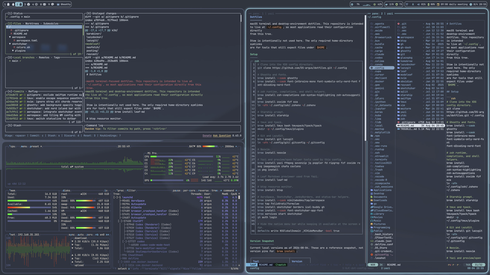

# Dotfiles

macOS terminal and desktop-environment dotfiles. This repository is intended
to live at `~/.config`, so most applications read their configuration directly
from this tree.

<p align="center">
  <a href="assets/desktop.webp">
    
  </a>
</p>

Stow is intentionally not used here. The only required home-directory symlinks
are for tools that still expect files under `$HOME`.

## Setup

```zsh
# Clone into the XDG config directory.
git clone https://github.com/DS-argus/dotfiles.git ~/.config

# Ghostty and fonts.
brew install --cask ghostty
brew install --cask font-jetbrains-mono font-symbols-only-nerd-font font-d2coding-nerd-font

# zsh runtime, completions, and shell helpers.
brew install zsh-completions zsh-syntax-highlighting zsh-autosuggestions
brew install zoxide fzf eza
ln -sfn ~/.config/zsh/.zshenv ~/.zshenv

# Starship prompt.
brew install starship

# tmux and tpack.
brew install tmux bash tmuxpack/tpack/tpack
mkdir -p ~/.config/tmux/plugins

# Git and LazyGit.
brew install git lazygit
ln -sfn ~/.config/git/.gitconfig ~/.gitconfig

# Neovim.
brew install neovim

# Yazi and preview/open helper tools used by this config.
brew install yazi ffmpeg sevenzip jq poppler fd ripgrep fzf zoxide resvg imagemagick chafa csvlens
ya pkg install

# Leaf Markdown previewer used from Yazi.
brew install leaf-md

# btop resource monitor.
brew install btop

# AeroSpace, SketchyBar, JankyBorders, and status-bar helpers.
brew install --cask nikitabobko/tap/aerospace
brew tap FelixKratz/formulae
brew install sketchybar borders ical-buddy gh
brew install --cask font-sketchybar-app-font
brew services start sketchybar
gh auth login

# Hide the native menu bar while keeping it available at the screen edge.
defaults write NSGlobalDomain _HIHideMenuBar -bool true
```

## Version Snapshot

Current local versions as of 2026-08-08. These are a reference snapshot, not
version pins for `brew install`.

| Tool | Version |
| --- | --- |
| Ghostty | 1.3.1 |
| zsh | 5.9 |
| zsh-completions | 0.36.0 |
| zsh-syntax-highlighting | 0.8.0 |
| zsh-autosuggestions | 0.7.1 |
| starship | 1.26.0 |
| tmux | 3.7b |
| tpack | 2.0.3 |
| bash | 5.2.37 |
| git | 2.55.0 |
| Neovim | 0.12.4 |
| Yazi | 26.5.6 |
| leaf-md | 1.27.0 |
| btop | 1.4.7 |
| AeroSpace | 0.21.3-Beta |
| SketchyBar | 2.24.0 |
| JankyBorders | 1.9.0 |
| sketchybar-app-font | 2.0.71 |
| icalBuddy | 1.10.1_1 |
| GitHub CLI | 2.97.0 |

## Required Symlinks

```zsh
ln -sfn ~/.config/zsh/.zshenv ~/.zshenv
ln -sfn ~/.config/git/.gitconfig ~/.gitconfig
```

Everything else in this README is expected to read directly from
`~/.config/<tool>`.

## Notes

- `zsh/privates.zsh` is intentionally ignored and sourced only when present.
- `tmux/plugins/` and `yazi/flavors/` are generated or installed content and are
  ignored by Git.
- Run `ya pkg install` after cloning or pulling Yazi plugin/flavor changes.
- AeroSpace requires macOS Accessibility permission.
- `icalBuddy` requires Calendar access for the SketchyBar upcoming-event item.
- Docker and Tailscale integrations are optional and hide themselves when their
  CLIs are unavailable.
